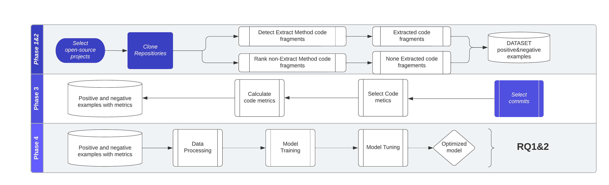
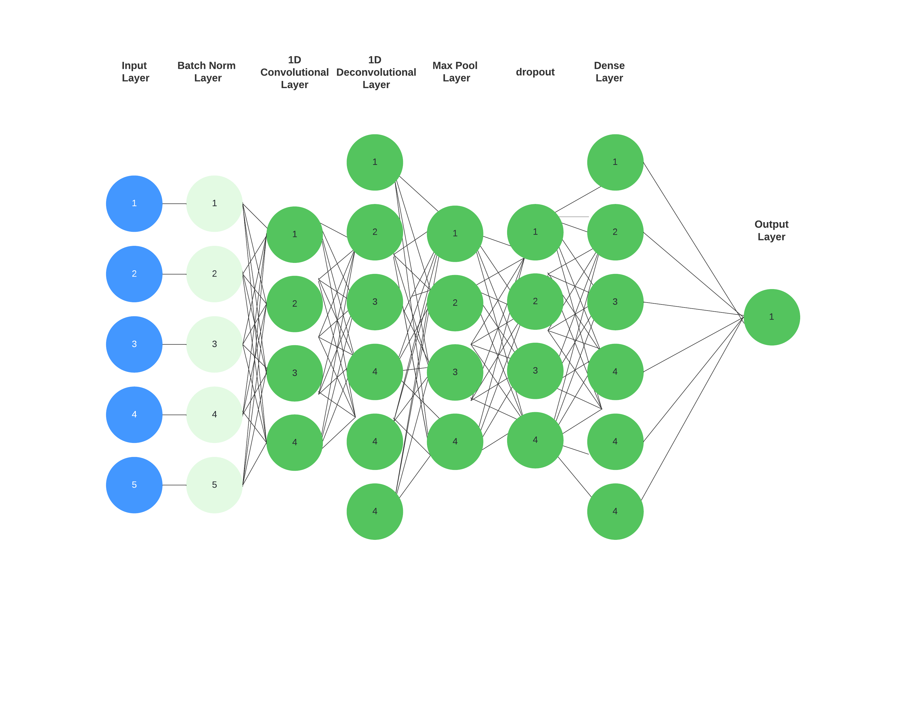

# DSCI.4_IdentificationExtractMethod

In order to successfully binary classify code fragments, we need to create a dataset consisting of positive and negative examples. Positive examples are code fragments that have undergone an Extract Method transformation, identified using RefactoringMiner tool . Negative examples are code fragments that are less likely to be extracted, identified by a ranking formula introduced by the work of Haas and Hummel [13].

The balanced dataset, consisting of equal number of positive and negative examples, is characterized by 78 metrics that have been extensively studied in previous studies. These metrics are going to be used as input attributes to the model. In order to train a binary classification model we label the positive and negative examples with “1” and “0” respectively.

The model, consisting of a Batch Normalization layer, 1D Convolutional layer, 1D Deconvolutional layer, Max Pooling layer with dropout and a Fully connected Dense layer, will consume the 78 metric values and produce a probabilistic decision about the whether the code fragment should be refactored or not.

In order to evaluate our work we define a set of research questions:
RQ1: How does our model perform compared to a machine learning baseline model?
RQ2: How does our model perform compared to other models?
## Install
### Create anaconda environment
    conda create --name myenv
### Activate environment
    activate myenv
### Activate environment (Windows)
    source activate myenv
### Install packages
Install the needed packages from requirements.txt

    pip install -r requirements.txt
### Data
Copy folders train,test in the data folder
### Train model
    python train_pipe.py
### Tensorboard 
To visualize metrics training activate env in another cmd

    tensorboard -logdir runs

## Bibliography

[1]	C. V. Lopes et al., “DéjàVu: a map of code duplicates on GitHub,” Proc. ACM Program. Lang., vol. 1, no. OOPSLA, p. 84:1-84:28, Oct. 2017, doi: 10.1145/3133908.
[2]	“The adverse effects of code duplication in machine learning models of code | Proceedings of the 2019 ACM SIGPLAN International Symposium on New Ideas, New Paradigms, and Reflections on Programming and Software.” https://dl.acm.org/doi/10.1145/3359591.3359735 (accessed Aug. 27, 2022).
[3]	“Cross-project code clones in GitHub | Semantic Scholar.” https://www.semanticscholar.org/paper/Cross-project-code-clones-in-GitHub-Gharehyazie-Ray/5812937e05870571ff3cd1bb6c31029372305dac (accessed Aug. 27, 2022).
[4]	“Some from Here, Some from There: Cross-Project Code Reuse in GitHub.” https://ieeexplore.ieee.org/document/7962379/ (accessed Aug. 27, 2022).
[5]	B. HU, Y. WU, X. PENG, J. SUN, N. ZHAN, and J. WU, “Assessing code clone harmfulness: Indicators, factors, and counter measures,” 2021 28th IEEE Int. Conf. Softw. Anal. Evol. Reengineering Virtual March 9-12 Proc., pp. 225–236, Mar. 2021, doi: 10.1109/SANER50967.2021.00029.
[6]	C. K. Roy, J. R. Cordy, and R. Koschke, “Comparison and evaluation of code clone detection techniques and tools: A qualitative approach,” Sci. Comput. Program., vol. 74, no. 7, pp. 470–495, May 2009, doi: 10.1016/j.scico.2009.02.007.
[7]	S. M. Olbrich, D. S. Cruzes, and D. I. K. Sjøberg, “Are all code smells harmful? A study of God Classes and Brain Classes in the evolution of three open source systems,” in 2010 IEEE International Conference on Software Maintenance, Sep. 2010, pp. 1–10. doi: 10.1109/ICSM.2010.5609564.
[8]	“When and why your code starts to smell bad | Proceedings of the 37th International Conference on Software Engineering - Volume 1.” https://dl.acm.org/doi/10.5555/2818754.2818805 (accessed Aug. 27, 2022).
[9]	N. Tsantalis and A. Chatzigeorgiou, “Identification of Move Method Refactoring Opportunities,” IEEE Trans. Softw. Eng., vol. 35, no. 3, pp. 347–367, May 2009, doi: 10.1109/TSE.2009.1.
[10]	F. Khomh, S. Vaucher, Y.-G. Guéhéneuc, and H. Sahraoui, “BDTEX: A GQM-based Bayesian approach for the detection of antipatterns,” J. Syst. Softw., vol. 84, no. 4, pp. 559–572, Apr. 2011, doi: 10.1016/j.jss.2010.11.921.
[11]	F. Khomh, M. D. Penta, Y.-G. Guéhéneuc, and G. Antoniol, “An exploratory study of the impact of antipatterns on class change- and fault-proneness,” Empir. Softw. Eng., vol. 17, no. 3, pp. 243–275, Jun. 2012, doi: 10.1007/s10664-011-9171-y.
[12]Mayrand, Leblanc and Merlo, "Experiment on the automatic detection of function clones in a software system using metrics," 1996 Proceedings of International Conference on Software Maintenance, 1996, pp. 244-253, doi: 10.1109/ICSM.1996.565012.
[13]Roman Haas and Benjamin Hummel. 2016. Deriving extract method refactoring suggestions for long methods. In International Conference on Software Quality. Springer, 144–155
